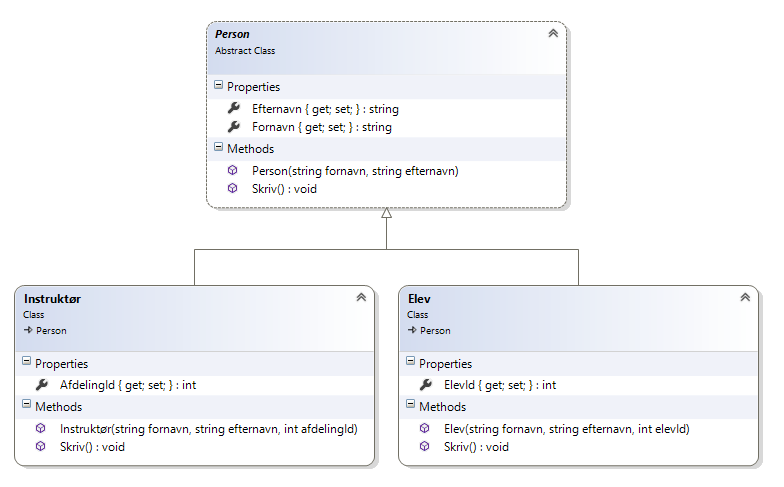

# Opgaveservice: Polymorfi

Tid til en simpel opgave der sætter fokus objektorienteret programmering.

Du skal i en konsolapplikation skabe tre klasser – en superklasse som de to andre klasser arver fra. I (noget der minder om) UML kan de beskrives som følger:

Den øverste klasse i hierarkiet - Person – har to egenskaber kaldet Fornavn og Efternavn. Disse egenskaber må aflæses offentligt men kun tildeles værdier i klassen selv. Klassen har derfor en konstruktør hvor egenskaberne kan tildeles en værdi (og dermed ikke nogen default konstruktør). Slutteligt har den en Skriv metode der blot til konsol (Console.WriteLine) udskriver det samlede navn (hvorfor ikke lege med ”interpolated strings”?). Denne metode skal kunne overskrives i klasser som arver fra den. Klassen må ikke benyttes til at skabe instanser – den må udelukkende benyttes til at arve fra.

Du skal også skabe en klasse kaldet Elev. Den arver fra Person men har sin egen egenskab (int) egenskab kaldet ElevId, som kun må aflæses offentligt. Tildeling skal ske internt i klassen, hvilket bør ske i en konstruktør. For at undgå dubleret kode bør konstuktøren fra Person genbruges. Klassen har sin egen overskrevne version af Skriv-metode, som udskriver det samlede navn samt ElevId.

Slutteligt skal du skabe klassen Instruktør som også arver fra Person. Den har sin egen (int) egenskab kaldet AfdelingsId, som kun må aflæses offentligt. Den har en konstruktør som Elev (men initialiserer naturligvis sin egen egenskab AfdelingsId), og bør ligeledes genbruge kode fra konstruktøren i Person. Den har sin egen overskrevne version af Skriv-metoden, som udskriver det samlede navn samt AfdelingsId.

Test klasserne i en simpel konsolapplikation ved at skabe en ny liste af personer (List< Person >), og tilføj en instruktør og otte elever. Løb efterfølgende listen igennem og udskriv det samlede navn ved at kalde Udskriv. 

Det vil se nogenlunde sådan ud:

## Overvejelser:
- Hvor benyttes der polymorfi i applikationen?
- Hvad er en abstrakt klasse?
- Hvad er en virtuel metode?

## Ekstra opgave
Hvis du har lyst kan du skabe en ny klasse, der repræsenterer et hold med en instruktør og op til 12 elever. Måske nedarvning fra den generiske List?

Du kunne måske også sørge for validering af egenskaberne i konstruktørerne.

